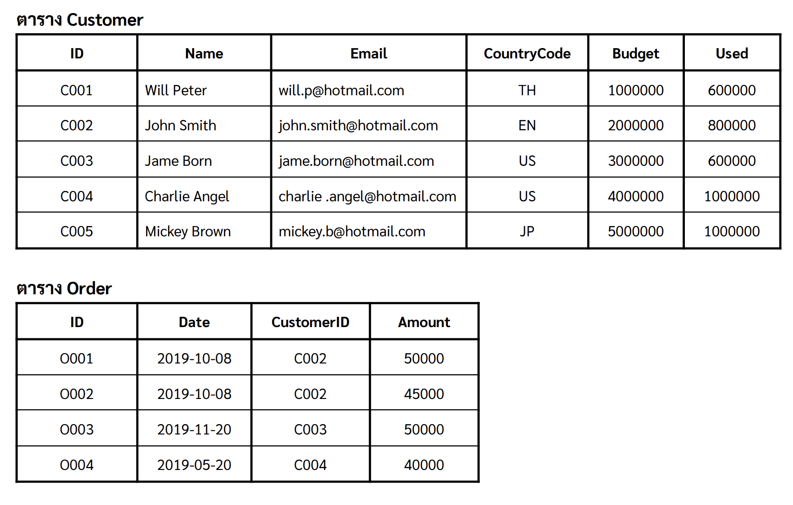
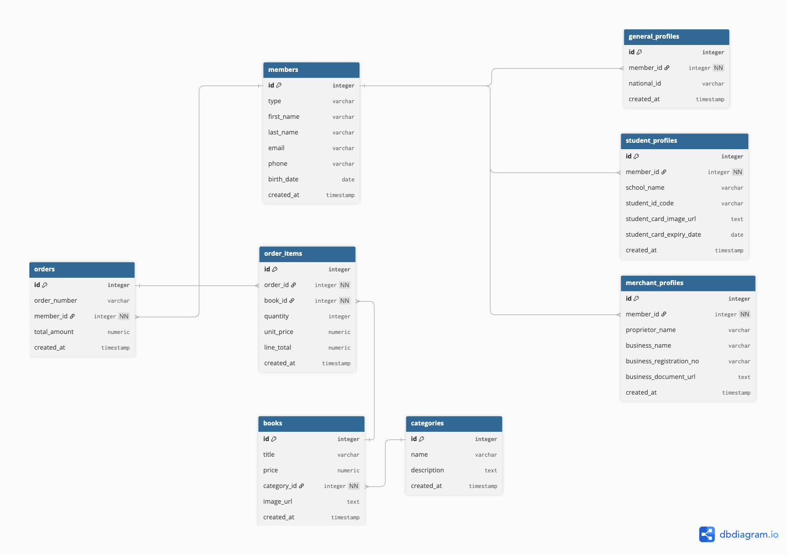
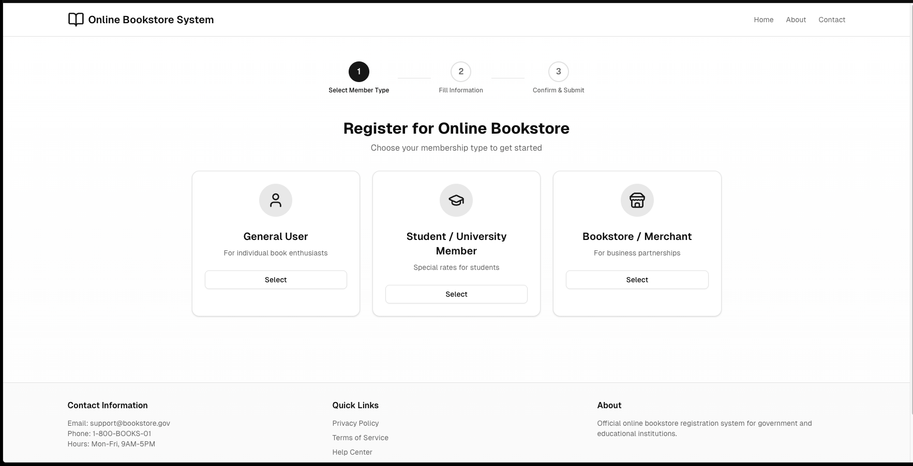
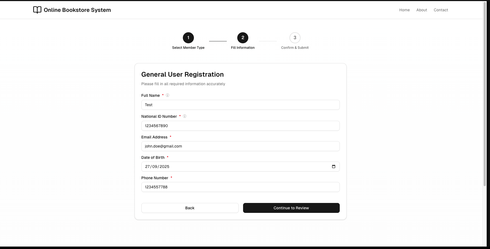
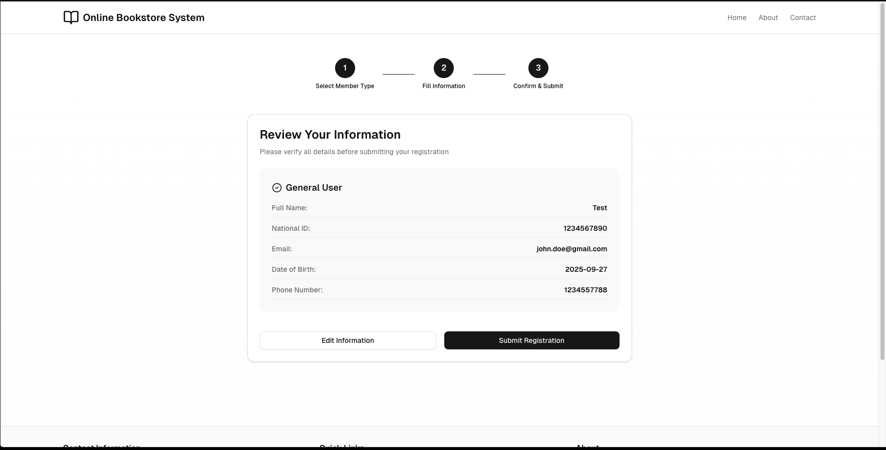
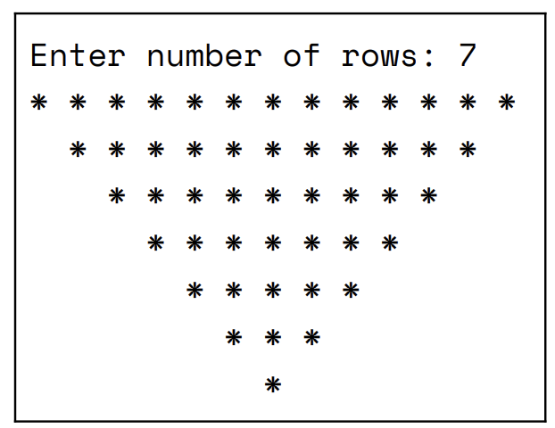
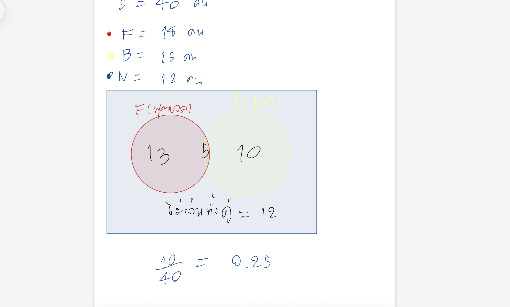
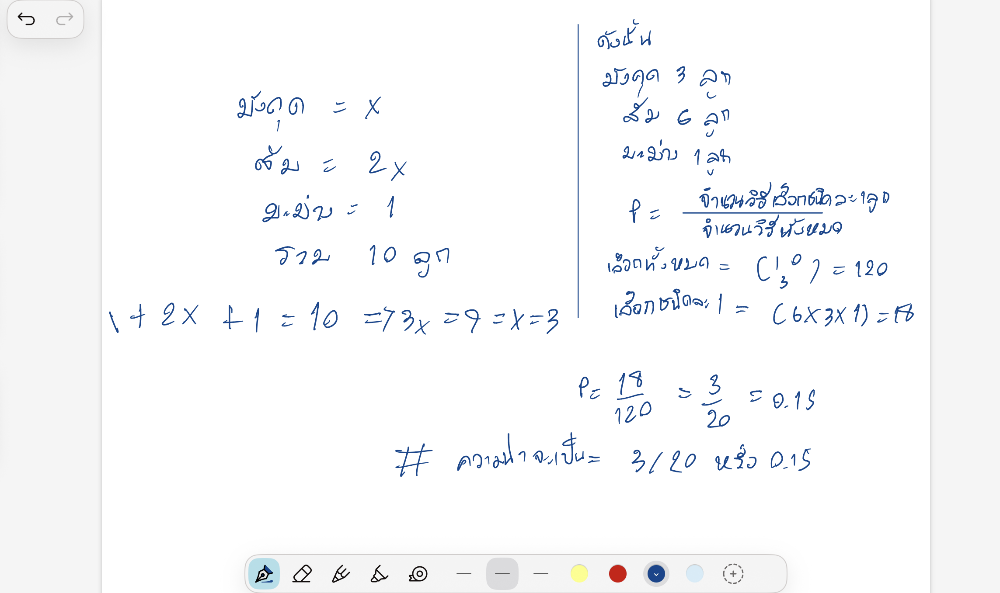
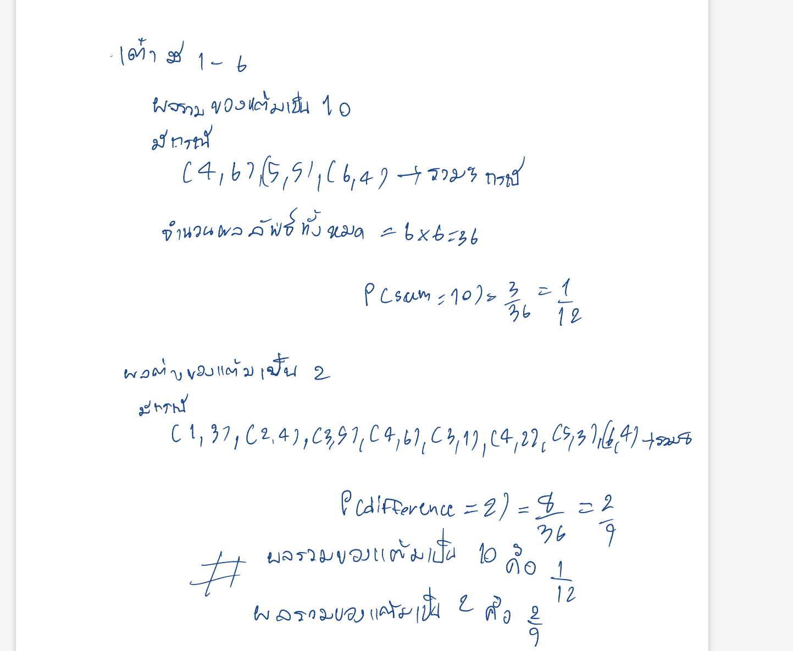

### การทดสอบความสามารถตำแหน่ง Programer



- **4. จากตาราง Customer ให้เขียน Query เพื่อแสดงข้อมูลม Used ที่มีค่ามากกว่า 500,000**

```sql
SELECT *
FROM Customer
WHERE Used > 500000;
```

- **5. จากตาราง Customer และตาราง Order ให้เขียน Query เชื่อมข้อมูล 2 ตารางเข้าด้วยกัน
โดยต้องแสดงทุก Record ที่อยู่ในตาราง Customer**

```sql
SELECT
  c.ID,
  c.Name,
  c.Email,
  c.CountryCode,
  c.Budget,
  c.Used,
  o.ID   AS OrderID,
  o.Date AS OrderDate,
  o.Amount
FROM Customer AS c
LEFT JOIN "Order" AS o
  ON o.CustomerID = c.ID;
```

- **6. ระบบจำหน่ายหนังสือออนไลน์ของหน่วยงานหนึ่ง ผู้ที่ต้องการซื้อหนังสือจากระบบนี้ จะต้องสมัครสมาชิกก่อนสั่งซื้อ โดยแบ่งประเภทของสมาชิกเป็นดังนี้
- บุคคลทั่วไป จะต้องทราบข้อมูล ชื่อ-นามสกุล, รหัสบัตรประชาชน, อีเมล์, วันเกิด, หมายเลขโทรศัพท์
→ นักเรียน/นักศึกษา จะต้องทราบข้อมูล ชื่อ-นามสกุล, ชื่อสถานศึกษา, รหัสประจำตัวนักเรียน/ นักศึกษา, แนบรูปภาพบัตรนักศึกษา, วันหมดอายุของบัตร, อีเมล์, วันเกิด, หมายเลขโทรศัพท์ 
→ ร้านค้า จะต้องทราบข้อมูล ชื่อผู้ประกอบการ, ชื่อสถานประกอบการ, เลขทะเบียนนิติบุคคล,แนบเอกสารนิติบุคคล, อีเมล์, หมายเลขโทรศัพท์
โดยหลังจากสมัครสมาชิกแล้ว ระบบจะให้ผู้ใช้ซื้อหนังสือได้ โดยข้อมูลหนังสือ จะประกอบไปด้วย รูปภาพ, ราคาหนังสือ, ประเภทของหนังสือ เมื่อผู้ใช้ซื่อหนังสือแล้ว ระบบจะบันทึกข้อมูลการสั่งซื้อหนังสือไว้ โดยข้อมูลประกอบไปด้วย เลขที่คำสั่งซื้อ, หนังสือที่ซื้อ จำนวนเล่ม, ราคารวมในรายการสั่งซื้อ
จากข้อมูลข้างต้น
1. ให้เขียน Flow ของระบบนี้
2. ให้เขียน ER Diagram ของระบบนี้
3. ให้ออกแบบหน้าจอระบบรับสมัครสมาชิก**








- **7. ถังน้ำใบหนึ่งบรรจุ 5,832 ลิตรถ้ามีการนำน้ำที่มีอยู่ในถัง ไปใช้ทุกวันตลอดสัปดาห์
โดยที่แต่ละวัน จะนำน้ำไปใช้ หนึ่งในสาม ของปริมาณน้ำในถัง
อยากทราบว่าเมื่อครบ x วันจะมีน้ำเหลืออยู่ในถังกี่ลิตร
ให้เขียนฟังก์ชัน y = Calculate(x) โดยใช้ภาษาใดก็ได้ เพื่อแก้ปัญหา**

```js
function Calculate(x) {
  const initial = 5832;
  return initial * Math.pow(2/3, x);
}

for (let day = 0; day <= 7; day++) {
  console.log(`Day ${day}: ${Calculate(day).toFixed(2)} liters`);
}


```

- **8. ให้เขียนโปรแกรมโดยภาษาใดก็ได้รับ Input เป็นตัวเลข 1 ตัว แล้วแสดงเป็นรูปสามเหลี่ยมกลับด้าน
ดังตัวอย่าง**



```js

let rows = parseInt(prompt("Enter number of rows: "));

for (let i = rows; i >= 1; i--) {
  let spaces = " ".repeat(rows - i);
  let stars = "* ".repeat(i);
  console.log(spaces + stars);
}

```

- **9. สำรวจนักเรียน 40 คน พบว่าเล่นฟุตบอล 18 คน เล่นบาสเก็ตบอล 15 คน และไม่เล่นทั้งฟุตบอลและ
บาสเก็ตบอล 12 คน ถ้าสุ่มนักเรียน 1 คน จงหาความน่าจะเป็นที่นักเรียนคนนี้จะเล่นบาสเก็ตบอล
แต่ไม่เล่นฟุตบอล พร้อมแสดงวิธีคิดด้วยแผนภาพเวนน์-ออยเลอร์**

```
ความน่าจะเป็น = 0.25 หรือ 1/4

```

- **10. ตะกร้าใบหนึ่งนึ่มีส้ม มังคุด และมะม่วงรวมกัน 10 ลูก โดยที่จำนวนส้มเป็นสองเท่าของจำนวนมังคุด และมี
มะม่วง 1 ลูก โดยที่ผลไม้ทุกลูกแตกต่างกัน ถ้าหยิบผลไม้อย่างไม่เจาะจงจากตะกร้าใบนี้จำนวน 3 ลูก
จงหาความน่าจะเป็นที่จะหยิบได้ผลไม้ชนิดละ 1 ลูก**





- **11. บวกเลขด้วยวิธีการใดก็ได้ โดยใช้เฉพาะเลข 8 ให้ได้คำ ตอบเท่ากับ 1,000**

```
888 + 88 + 8 + 8 + 8 = 1000
```

- **12. ทอดลูกเต๋า 2 ลูก 1 ครั้งให้หาความน่าจะเป็น ที่
1. ผลรวมของแต้มเป็น 10 
2. ผลต่างของแต้มเป็น 2**



```
ผลรวม = 10	1/12
ผลต่าง = 2	2/9

```